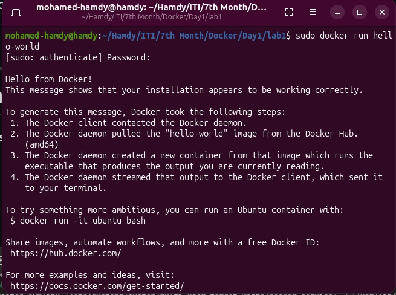
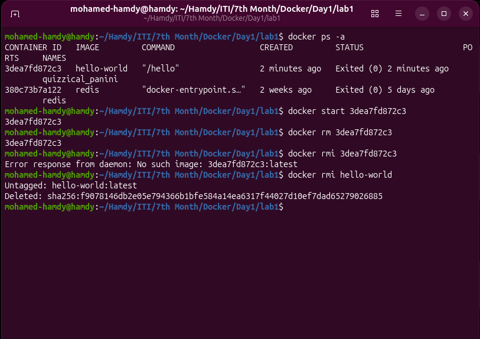
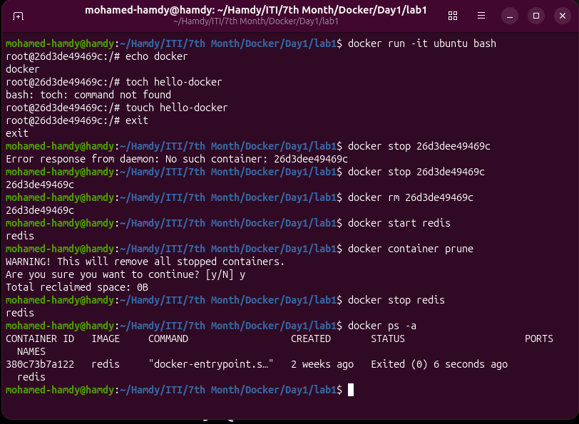
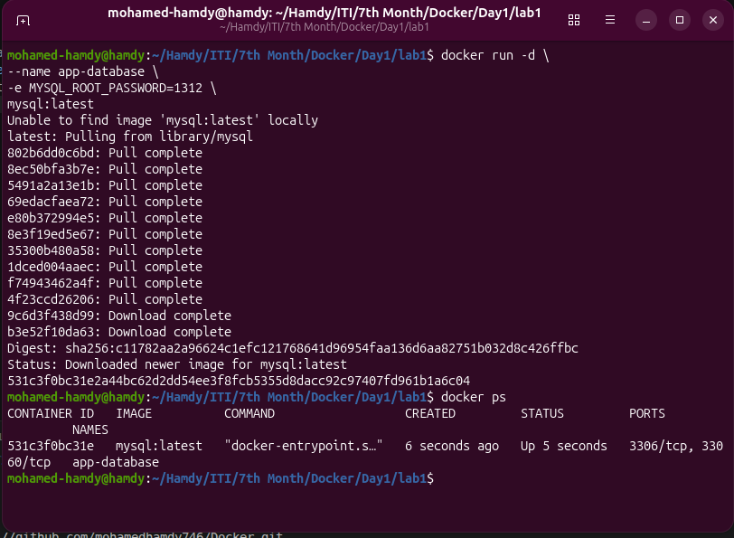
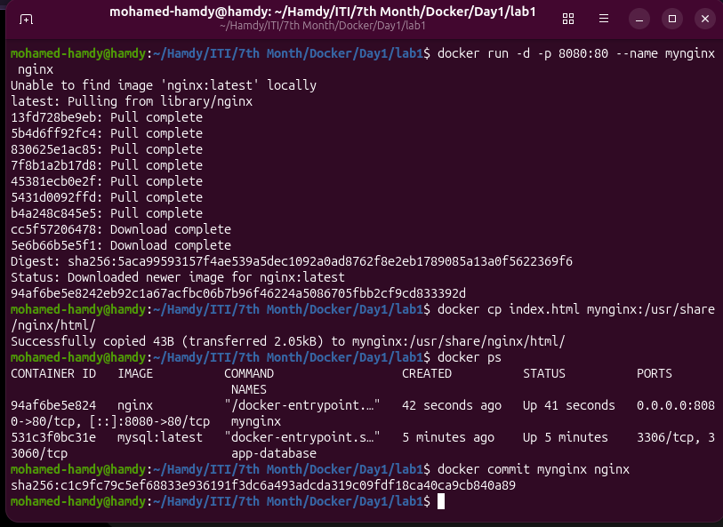
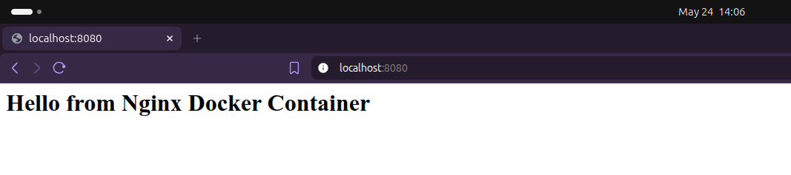
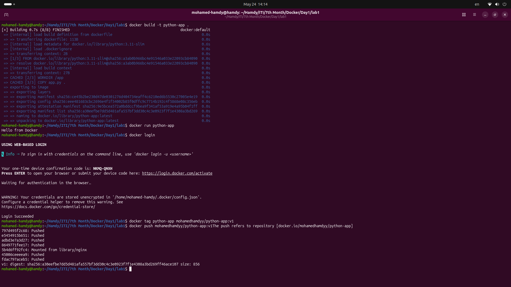

### What is the difference between:

#### ▪ CMD & ENTRYPOINT

- CMD: Default command/arguments, Easily overridden, Flexible defaults
- ENTRYPOINT: Main executable, Harder to override. Fixed container behavior

#### ▪ COPY & ADD

- COPY: Copies local file into container.
- ADD: Automatically extracts compressed archive.

---

# Problem 1

### Tasks

- Run the container `hello-world`
- Check the container status
- Start the stopped container
- Remove the container
- Remove the image

---

# Problem 2

### Tasks

- Run container `centos` or `ubuntu` in an interactive mode
- Run the following command in the container:

My comment: The file is deleted after removing the container because container storage is ephemeral unless volumes are used.

---

# Problem 3

### Tasks

- Deploy a MySQL database called `app-database`
- Use the `mysql:latest` image
- Use the `-e` flag to set:

---

# Problem 4

### Tasks

- Run the image `Nginx`
- Add HTML static files to the container and make sure they are accessible
- Commit the container with image name `IMAGE_NAME`

---

# Problem 5

### Tasks

- Create a simple Python app
- Create a Dockerfile to containerize the Python app
- Build the image and test it
- **(Bonus)** Create a Dockerfile for the same app in smaller size using multi staging
- Push the created image into your Docker Hub repo

# Bonus

Create a Dockerfile for the same app in smaller size using multi staging:

FROM python:3.11 AS builder

WORKDIR /app

COPY app.py .

FROM python:3.11-slim

WORKDIR /app

COPY --from=builder /app/app.py .

CMD ["python", "app.py"]
